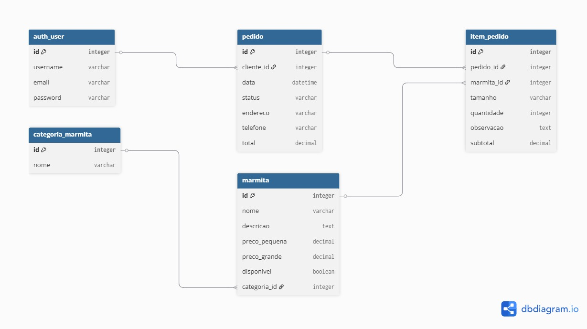

# 🍱 Sistema de Delivery de Marmitas

Projeto desenvolvido para a disciplina **GAC116 - Programação Web** utilizando o framework Django.

A aplicação simula um sistema de delivery de marmitas, permitindo o gerenciamento de categorias, produtos e pedidos através de um ambiente administrativo autenticado.

---

## 👥 Integrantes

* Maria Eduarda Ferreira da Silva
* Vitória Christie Amaral Santos

---

## 🚀 Funcionalidades Implementadas

* Autenticação utilizando o sistema de usuários do Django
* Ambiente administrativo customizado com Jazzmin
* Cadastro de categorias de marmitas
* Cadastro de marmitas
* Controle de disponibilidade das marmitas
* Cadastro de pedidos
* Cadastro de itens do pedido
* Relacionamento entre entidades utilizando banco de dados relacional
* Cálculo automático de subtotal e total dos pedidos

---

## 🗂️ Modelagem

O sistema possui as seguintes entidades:

* CategoriaMarmita
* Marmita
* Pedido
* ItemPedido
* User (Django)

### Relacionamentos


---

## 💻 Tecnologias Utilizadas

* Python 3
* Django 6
* SQLite3
* Jazzmin
* Git/GitHub

---

## ⚙️ Como Executar o Projeto

### 1. Clonar o repositório

```bash
git clone https://github.com/vitoriaamarals/sistema-restaurante-django
```

### 2. Entrar na pasta do projeto

```bash
cd sistema-restaurante-django
```

### 3. Criar ambiente virtual

```bash
python -m venv venv
```

### 4. Ativar ambiente virtual

#### CMD

```bash
venv\Scripts\activate
```

### 5. Instalar dependências

```bash
pip install -r requirements.txt
```

### 6. Aplicar migrations

```bash
python manage.py migrate
```

### 7. Criar superusuário

```bash
python manage.py createsuperuser
```

### 8. Executar servidor

```bash
python manage.py runserver
```

---

## 🔐 Acesso ao Sistema

### Painel administrativo

```text
http://127.0.0.1:8000/admin
```

---

## 📁 Estrutura do Projeto

```text
sistema-restaurante-django/
├── assets/
├── core/
│   ├── migrations/
│   ├── admin.py
│   ├── models.py
├── restaurante/
│   ├── settings.py
├── manage.py
|── README.md
├── requirements.txt
```

---
